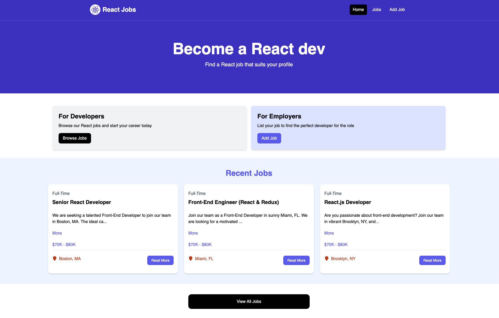

# Job Posting Website with React and Vite

## Overview
The **Job Posting Website** is a comprehensive job listing application built using **React** and **Vite**. This project demonstrates the setup and configuration of React with Vite, styling using **Tailwind CSS**, and key React features such as hooks, components, and routing. Users can perform CRUD operations on job listings, including viewing, adding, editing, and deleting job posts. The application also integrates **JSON Server** for mock API interactions and **React Toastify** for user notifications.

## Live Demo
🚀 **Try it out here:** [Job Posting Website](https://job-posting-website-with-react-and-vite.vercel.app/)

## Features
- **React Components & Hooks**: Efficient state management using `useState` and `useEffect`.
- **Routing with React Router**: Implements a **Single Page Application (SPA)** architecture.
- **Data Fetching & State Management**: Fetch job listings dynamically and manage state.
- **Form Handling & CRUD Operations**: Users can create, update, and delete job listings.
- **Tailwind CSS for Styling**: Clean and modern UI with Tailwind CSS.
- **JSON Server as Mock API**: Simulated backend functionality for testing API interactions.
- **React Toastify for Notifications**: Provides user feedback with toast notifications.
- **Static Asset Building**: Optimized production-ready build using Vite.

## Tech Stack
- **Frontend**: React, Vite, Tailwind CSS
- **Backend**: JSON Server (Mock API)
- **Libraries & Tools**: React Router, React Toastify, Axios

## Deployment
The application is deployed on **Vercel**.

## Project Highlights
- Demonstrates **React Best Practices**.
- Implements a **functional job posting system** with full CRUD operations.
- Uses **modern UI frameworks** like Tailwind CSS for styling.
- Provides **real-time notifications** using React Toastify.
- Deploys effortlessly using **Vercel**.

## Future Enhancements
- Integrating a real backend (Node.js/Express with a database like MongoDB or PostgreSQL).
- Adding authentication (JWT, Firebase Auth, etc.).
- Enhancing job filtering and search functionality.

## License
This project is open-source and available under the MIT License.

---
